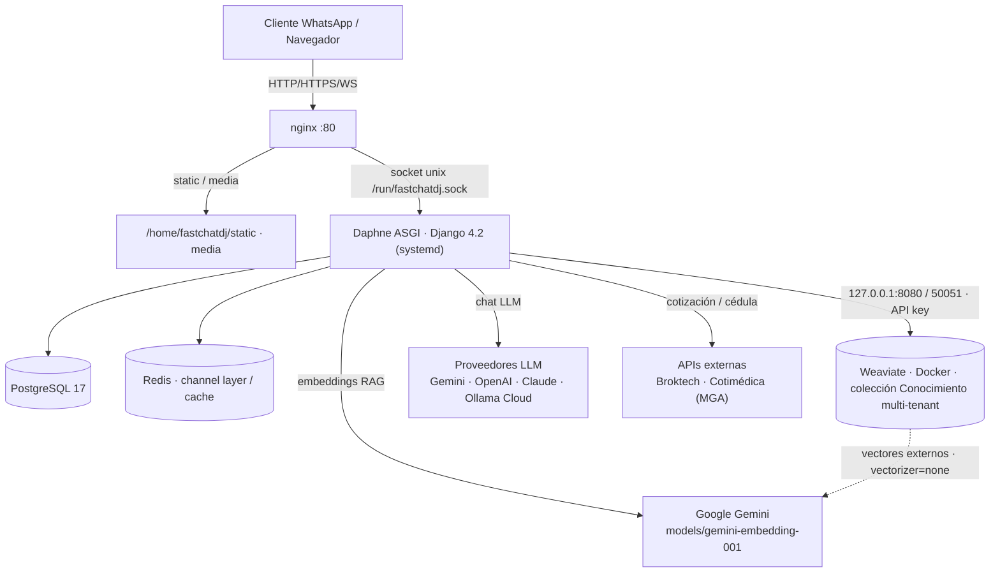

# Informe de Implementación — Sistema de IA / RAG de MensajerIA (FastChat DJ)

> Documento técnico-ejecutivo de entrega al cliente.
> Producto: **FastChat DJ** (MensajerIA) — SaaS de mensajería WhatsApp con IA.
> Alcance de este informe: la capa de **Inteligencia Artificial y RAG** (recuperación aumentada por conocimiento), el **cotizador médico** y la **administración 100% desde el panel web**.
> Fecha: 2026-07-18.

---

## 1. Resumen ejecutivo

### 1.1. Qué es el sistema

FastChat DJ es una plataforma **multi-tenant** (varias empresas/clientes sobre la misma instalación) de atención por WhatsApp con **agentes de inteligencia artificial**. Cada empresa configura uno o más agentes conversacionales que responden a sus clientes usando modelos de lenguaje (LLM) de distintos proveedores (Google Gemini, OpenAI, Anthropic Claude y Ollama Cloud).

Sobre esa base, en esta fase se construyó una **capa transversal de conocimiento (RAG)**: cada agente puede tener su propia **base de conocimiento privada** (documentos, preguntas frecuentes, catálogos, tarifarios) contra la cual responde. El sistema recupera únicamente los fragmentos relevantes a cada pregunta y **prohíbe al modelo inventar datos** que no estén respaldados por ese conocimiento (grounding anti-alucinación).

Como primer caso de negocio real se implementó el **cotizador médico "Vida Buena" (MGA)**: un motor de tarifas y coberturas parametrizado en base de datos, un cotizador web público con captura de datos por cédula, y una herramienta que el chatbot usa para dar precios exactos.

### 1.2. Qué se logró en esta fase (en lenguaje claro)

1. **Conocimiento por agente, aislado y anti-alucinación.** Cada agente tiene su propio "cajón" de conocimiento (un *tenant* en Weaviate). Cuando un cliente pregunta algo, el agente busca la respuesta en su cajón y responde solo con lo que encuentra. Si no encuentra nada relevante, dice "No tengo esa información" en lugar de inventar.

2. **Todo se administra desde el panel web.** Antes había que entrar por SSH al servidor y correr comandos manuales para cargar conocimiento o cambiar el modelo. Ahora el cliente:
   - Sube documentos (PDF, Word, Excel, CSV, JSON, TXT) desde la pestaña **Conocimiento** del agente, y se indexan solos al RAG.
   - Elige el **modelo de IA** desde una lista **en vivo** que trae la plataforma directamente desde la API del proveedor (ya no una lista fija en código).
   - Edita el **prompt** (las instrucciones del agente) desde la interfaz, con una plantilla recomendada y variables.
   - Al **crear un agente nuevo**, este nace ya con su base de conocimiento lista para usarse.

3. **Cotizador médico funcionando.** Motor de tarifas exacto (validado contra el cotizador oficial de MGA), cotizador web con autocompletado por cédula y una herramienta de cotización que el chatbot invoca para dar precios reales.

4. **Multi-proveedor de IA, incluido Ollama Cloud.** El sistema soporta Gemini, OpenAI, Claude y Ollama Cloud. El modelo se cambia desde el panel sin tocar código.

### 1.3. Estado

La totalidad de lo descrito está **implementada y desplegada en el servidor de staging** (`/home/fastchatdj`, rama `reformula`) y verificada en vivo. Quedan pendientes de menor alcance y de infraestructura/seguridad que se detallan en la sección 5 y en el documento `SEGURIDAD.md`.

---

## 2. Arquitectura del sistema

### 2.1. Componentes

| Componente | Rol | Detalle |
|---|---|---|
| **Django 4.2 + Daphne (ASGI)** | Aplicación web y motor del chat | Servido por Daphne (systemd) sobre socket Unix `/run/fastchatdj.sock` |
| **nginx** | Reverse proxy | Puerto 80; sirve `static/` y `media/`; el resto (HTTP + WebSocket) va al socket de Daphne |
| **PostgreSQL 17** | Base de datos relacional | Perfiles, agentes, API keys, conversaciones, planes y tarifas del cotizador |
| **Redis** | Channel layer / cache (opcional) | Configurado; si no corre, Channels opera en memoria (válido con un solo proceso Daphne) |
| **Weaviate (Docker)** | Base de datos vectorial (RAG) | Colección `Conocimiento`, multi-tenant, solo `localhost` (127.0.0.1:8080 REST / 50051 gRPC), autenticada por API key |
| **Proveedores LLM** (externos) | Modelos de lenguaje y embeddings | Gemini, OpenAI, Claude, Ollama Cloud (chat) + Gemini (embeddings del RAG) |

### 2.2. Diagrama de infraestructura



### 2.3. Flujo de una consulta con RAG (anti-alucinación)

```mermaid
sequenceDiagram
    participant U as Cliente
    participant A as AgenteConsultor (Django)
    participant G as Gemini (embeddings)
    participant W as Weaviate (tenant agente_<id>)
    participant L as LLM del agente (Ollama/Gemini/...)

    U->>A: Pregunta
    A->>A: Detecta si el agente tiene tenant con documentos + key Gemini
    A->>G: Embebe la consulta (vector)
    G-->>A: Vector de la consulta
    A->>W: Búsqueda semántica (near_vector) en el tenant del agente
    W-->>A: Fragmentos más cercanos + distancia
    A->>A: Filtra por distancia (umbral 0.75); trunca al presupuesto de contexto
    alt Hay fragmentos relevantes
        A->>L: Prompt + SOLO el contexto recuperado
        L-->>A: Respuesta basada en el conocimiento
    else No hay nada relevante
        A->>L: Instrucción SIN_DATOS → "No tengo esa información"
        L-->>A: "No tengo esa información" (no inventa)
    end
    A-->>U: Respuesta
```

**Puntos clave del flujo:**

- **Detección automática de Weaviate** (`agente_consultor._detectar_weaviate`): el agente usa el RAG solo si su tenant tiene documentos indexados (`weaviate_rag.contar > 0`) y hay una API key de Gemini activa en el perfil. Si no, cae al comportamiento anterior (FAISS/contexto estático) sin romperse.
- **Grounding estricto** (`_construir_contexto_weaviate`): si no hay nada suficientemente cercano, se inyecta el bloque `SIN_DATOS` que ordena responder únicamente "No tengo esa información" y prohíbe usar conocimiento externo.
- **Umbral de relevancia**: distancia coseno máxima `0.75` (`_DIST_MAX_RELEVANTE`). Fragmentos más lejanos se descartan.
- **Presupuesto de contexto**: `cfg_max_context_chars` (default 4000). Un fragmento más grande que el presupuesto se **trunca** (no se descarta), para no perder documentos grandes indexados por ciudad/categoría.

---

## 3. Detalle de lo implementado

### 3.1. RAG transversal con Weaviate multi-tenant

**Un solo Weaviate**, una sola colección `Conocimiento`, con **multi-tenancy**: **un tenant por AGENTE** (`agente_<id>`). Cada agente tiene su base de conocimiento completamente aislada de los demás.

- Módulo: `agents_ai/weaviate_rag.py`.
- Colección `Conocimiento` con `Configure.multi_tenancy(enabled=True, auto_tenant_creation=True)` y `Configure.Vectorizer.none()` (**vectores externos / BYO vectors**: los embeddings los genera la aplicación, no Weaviate — esto mantiene el servidor ligero, sin carga de CPU/RAM por vectorización).
- Propiedades por objeto: `content`, `source`, `tipo`, `categoria`.
- **Embeddings con Google Gemini**, modelo `models/gemini-embedding-001` (constante `EMBED_MODEL`). El embebido se hace en lotes con pausa y *backoff* exponencial ante error 429 (rate limit).
- Conexión: `weaviate.connect_to_local(host, http_port, grpc_port, auth=API key)`, configurable por variables de entorno o por `/home/weaviate/.env`.

Funciones principales de `weaviate_rag.py`:

| Función | Rol |
|---|---|
| `get_client()` | Cliente Weaviate v4 autenticado (localhost) |
| `tenant_de_empresa(id)` | Devuelve `agente_<id>` (nombre de tenant determinista) |
| `ensure_schema(client)` | Crea la colección multi-tenant si no existe |
| `ensure_tenant(client, id)` | Asegura el tenant del agente |
| `indexar_documentos(id, key, docs, reemplazar)` | Embebe e inserta objetos en el tenant |
| `buscar(id, key, query, k)` | Búsqueda semántica `near_vector` con distancia |
| `borrar_por_source(id, source)` | Borra objetos de una fuente (reindexado idempotente) |
| `contar(id)` | Nº de objetos en el tenant |
| `resumen_fuentes(id)` | Lista de fuentes agrupadas por `source` (para la UI) |

**Nota de arquitectura:** originalmente el tenant era por empresa (`empresa_<perfil_id>`), lo que hacía que varios agentes de un mismo perfil compartieran conocimiento (bug de aislamiento). Se migró a **tenant por agente** (`agente_<id>`) copiando los vectores existentes sin re-embeber (ver sección 4).

### 3.2. Motor del chat con detección y grounding

- Módulo: `agents_ai/agente_consultor.py`.
- En su construcción resuelve `self.agente_tenant_id = agente.id` (tenant Weaviate) y `self.empresa_id = agente.perfil_id` (para la key de Gemini y los planes del cotizador).
- `_resolver_embed_key()`: busca una API key Gemini activa del perfil (`ApiKeyIA` con `proveedor=2, estado=True, status=True`, la de id más alto).
- `_detectar_weaviate()`: activa el RAG solo si hay tenant con documentos + key Gemini.
- `_contexto_weaviate(query, query_raw)`: busca con la consulta **enriquecida** y con la **pregunta cruda** (para que una pregunta autosuficiente no se pierda), deduplica, ordena por distancia, filtra por umbral y arma el contexto respetando/truncando el presupuesto.
- Herramienta `cotizar_plan(nombre_plan, edad, genero)` (`_build_tools`): se registra solo si la empresa del agente tiene planes en el cotizador; devuelve la prima exacta en variantes Básico y Plus usando `cotizador.motor_tarifario`.

### 3.3. Subir documentos desde el panel → indexación automática

- Pestaña **Conocimiento** del agente → botón **"Subir documento"**.
- Acción del panel: `subir_documento` (en `crm/view_mientrenamiento.py`), multipart.
  - Extensiones permitidas: **PDF, CSV, XLSX/XLS, JSON, TXT, DOCX**. Tamaño máximo: **20 MB**.
  - Guarda el archivo como `DetalleAgentesAI(tipo=2)` y llama a `indexador_conocimiento.reindexar_agente(agente)`.
- Módulo puente: `agents_ai/indexador_conocimiento.py`.
  - `reindexar_agente(agente) -> dict`: recorre las fuentes del panel del agente (`DetalleAgentesAI`), extrae texto (`.txt` y `.docx` nativos; PDF/CSV/XLSX/JSON vía `VectorStoreManager._extract_raw_text`), trocea a ~1000 caracteres respetando párrafos e indexa al tenant `agente_<id>`.
  - **No destructivo por fuente**: cada fuente tiene un `source` estable `panel_detalle_<id>`; se borra e reinserta solo esa fuente, conservando sources cargados por otras vías (`cuestionario`, `centros_medicos`, etc.). Además limpia vectores huérfanos de fuentes borradas (soft-delete).
  - `provisionar_tenant(empresa_id) -> bool`: asegura schema + tenant; nunca lanza excepción (degrada limpio si Weaviate/Gemini no están, útil en entorno local sin Weaviate).
  - Embeddings: resuelve la key Gemini del perfil (`proveedor=2`), igual que el consultor.

### 3.4. Configuración 100% desde el admin web

Antes por SSH/management commands; ahora todo por UI (sin migraciones: los defaults se resuelven por vista/formulario).

- **Modelo LLM con lista viva**: `providers/__init__.py::listar_modelos_disponibles(proveedor_id, api_key, force_refresh)` trae la lista de modelos **directamente de la API del proveedor**, con caché Django de 1800 s y *fallback* a la lista estática `MODELOS_DISPONIBLES`. Acción de panel: `listar_modelos`.
  - Endpoints de listado por proveedor:
    - **Gemini**: `GET v1beta/models?key=<API_KEY>` (paginado, solo modelos con `generateContent`).
    - **OpenAI**: `GET /v1/models` con `Authorization: Bearer` (filtra audio/imagen/embeddings/moderación).
    - **Claude**: `GET /v1/models` con `x-api-key` + `anthropic-version: 2023-06-01`.
    - **Ollama Cloud**: `GET https://ollama.com/v1/models` con `Authorization: Bearer`.
- **Prompt editable**: `agents_ai/prompts_recomendados.py::PROMPT_RECOMENDADO` (plantilla factual genérica). En el tab Prompt hay un botón "Cargar plantilla recomendada". Variables soportadas por el motor (`_VARS_REQUERIDAS`): `question`, `context`, `contexto_extra`, `nombre_bot`, `personalidad`, `tono`, `estilo_escritura`, `nombre_empresa`, `productos`, `servicios`, y avanzadas (`contacto_nombre`, `hora_local`, `estado_animo`, `guia_animo`, `historial_contacto`, `fuera_horario`, `horario_atencion`, `es_primer_mensaje`).
- **Separación de responsabilidades** (pedido del cliente): el editor de API Keys guarda **solo la credencial**; el **modelo** se elige en la Configuración del agente (dropdown con lista viva) y se persiste en `ApiKeyIA.modelo`.
- **Auto-provisión al crear agente**: la acción `addagente` llama `provisionar_tenant(agente.id)` tras guardar → el agente nuevo nace con su tenant Weaviate listo.
- **Reindexar desde el panel**: acción `rag_reindex` (botón "Reindexar al RAG" en la pestaña Conocimiento) reconstruye las fuentes del panel en el tenant y devuelve el resumen de fuentes para refrescar la UI. En "Procesar agente" (`procesaragente`) el reindex a Weaviate se ejecuta **diferido, después del commit** de la transacción (patrón `_reindex_pendiente`), para no mantener llamadas HTTP dentro de `transaction.atomic()`.

### 3.5. Proveedores LLM (incluido Ollama Cloud)

- Registry: `agents_ai/providers/__init__.py`. Ids (`PROVEEDOR_CHOICES` en `crm/models.py`): **2=Gemini, 3=OpenAI, 4=Claude, 5=Ollama**.
- Interfaz común `BaseProvider`: `default_model()`, `get_llm()`, `get_embeddings()`, `extract_tokens()`, `list_models()`.
- **Ollama Cloud** (`providers/ollama.py`): usa `langchain_openai.ChatOpenAI` con `base_url=https://ollama.com/v1`. Motivo: el `ChatOpenAI` de `langchain_community` (deprecado) **no soporta `bind_tools`** con Ollama (rompía el tool-calling); el de `langchain_openai` sí. Ollama Cloud no ofrece embeddings, por eso `get_embeddings` lanza `NotImplementedError` y el RAG usa Gemini.
- **Modelo activo de Vida Buena**: `gemma4:31b` (key Ollama del perfil).

> **Versiones FIJADAS (críticas — no subir):** `langchain-core==0.3.67`, `langchain-openai==0.2.14`, `openai==1.93.0`. Subir `langchain-openai` a 1.x arrastra `langchain-core` 1.x y **rompe** el ecosistema 0.3.x. `numpy` debe permanecer en la serie **1.26.x** (no 2.x; `sentence-transformers` lo había subido a 2.x rompiendo `numba`/`whisper`).

### 3.6. Cotizador médico (app `cotizador`)

- Modelo parametrizable en BD (nada fijo en código), multi-tenant por `PerfilNegocioIA`:
  `Plan`, `Tarifa`, `Cobertura`, `Carencia`, `Exclusion`, `BeneficioAdicional`, `ProcedimientoDental`, `VigenciaTarifaria`, `RangoEtario`.
- **Motor tarifario** (`cotizador/motor_tarifario.py`): la prima depende de **edad + género + rango etario + plan + variante dental**, consultados desde las tablas. Para grupos (titular+1 / familia) la prima total = suma de primas individuales. Los rangos etarios usan límite superior exclusivo `[X, Y)` salvo el último tramo.
- **Cotizador web** (`cotizador/views.py`, `urls.py`, template): `cotizador_view` (tarjetas comparativas), `api_cotizar` (JSON con primas Básico/Plus por plan) y `api_cliente_cedula` (captura por cédula). URL pública: `/cotizador/`.
- **Captura por cédula con fallback**: `api_cliente_cedula` intenta primero **Broktech** (`POST` con Basic Auth) y, si falla, cae a **Cotimédica** (`GET` sin auth). Normaliza ambas a `{ok, fuente, data{edad, sexo, nombres, ...}}`. Credenciales por variables de entorno `VIDANUEVA_USER` / `VIDANUEVA_PASS` (en `/etc/fastchatdj.env`).
- **Herramienta del chat** `cotizar_plan`: da precios exactos en el chat. Validado: coincide con el cotizador oficial de MGA (p.ej. Magno 28 M: Básico $52.41 / Plus $54.91).

---

## 4. Fixes clave de esta sesión

| # | Problema | Solución |
|---|---|---|
| a | **Keys Gemini muertas en el pool.** De 9 keys Gemini del perfil, solo 1 era válida; el consultor resolvía la más nueva (inválida) → embeddings caídos → RAG del bot sin datos. | Se **deshabilitaron** (`estado=False`) las keys inválidas para que resuelva la válida → embeddings y RAG revivieron. *(Fix de datos; el fix robusto pendiente es un failover de key de embeddings.)* |
| b | **Migración de tenant empresa → agente.** El tenant era por empresa; varios agentes compartían conocimiento. | Se copiaron los vectores de `empresa_2` a `agente_22` (410 docs) **sin re-embeber**; `empresa_2` queda como respaldo. |
| c | **Truncación de contexto (docs grandes se perdían).** Un fragmento mayor al presupuesto (`> 4000` chars, p.ej. centros por ciudad) rompía el bucle en el primer chunk → contexto vacío → `SIN_DATOS` → el bot decía "no tengo". | En `_contexto_weaviate` el fragmento grande ahora se **trunca al presupuesto** en vez de descartarse. Además se busca con la query enriquecida **y** la pregunta cruda. |
| d | **Trace del chat mostraba "RAG: No".** El traza usaba `agente.vectorstore_path` (FAISS viejo) y etiquetaba mal el proveedor. | Ahora usa `consultor.usar_weaviate` (refleja Weaviate) y mapea correctamente Ollama/Gemini/OpenAI/Claude. |
| e | **Markdown en el chat de prueba.** | Función `mdToHtml` en `chat.html` (negrita, código, listas). |

---

## 5. Estado actual

### 5.1. Qué funciona (verificado en vivo)

- RAG por agente con tenant aislado (`agente_22` = 410+ documentos), grounding anti-alucinación operativo.
- Subida de documentos desde el panel → indexación automática al tenant del agente (verificado con `.txt` y `.docx`).
- Lista de modelos en vivo desde la API (Ollama: 18 modelos, incl. `gemma4:31b`).
- Prompt editable con variables de negocio (`nombre_empresa`, `productos`, `servicios`) cableadas.
- Cotizador web y herramienta `cotizar_plan` del chat, con precios coincidentes con el cotizador oficial de MGA.
- Captura por cédula con fallback Broktech → Cotimédica.
- Editor de agente rediseñado (4 pestañas: Configuración, Conocimiento, Prompt, Avanzado).

### 5.2. Pendientes (según memoria del proyecto)

**De la capa de IA / cotizador:**
- **Failover robusto de key de embeddings** en `agente_consultor` e `indexador` (hoy el fix de las keys muertas es a nivel de datos; si reingresan keys inválidas más nuevas, recurre).
- Cotización **multi-integrante** (titular+1 / familia) en la UI web y el chat (el motor ya lo soporta).
- **PDF de cotización**, filtros comerciales y "ver detalle completo" en las tarjetas.
- Limpiar la fuente PDF antigua (Avianca) del agente 22.
- **WhatsApp omnicanal** para el flujo del cotizador (reutiliza los mismos endpoints).
- **Emisión de póliza + pasarela de pago**: depende de accesos que debe proveer MGA/la aseguradora.

**De infraestructura (comunes al servidor de staging):**
- Levantar **Redis** para escalar Channels a varios workers.
- Desplegar/conectar el **microservicio Baileys** (WhatsApp no oficial, puerto 3000).
- Programar los **cron_jobs** (campañas, recordatorios, etc.).
- Migrar **Daphne a usuario no-root** y unificar los `*.service`.

**De seguridad (detalle en `SEGURIDAD.md`):**
- Revocar el **token de GitHub** expuesto en la URL del remote.
- Endurecer **SSH** (root con password), restringir `ALLOWED_HOSTS`, habilitar **HTTPS**, corregir permisos de `credenciales.json`.

**De despliegue:**
- Subir el código a GitHub (rama `reformula`) — hay muchos archivos cambiados en el servidor sin commit.

---

## 6. Referencias de archivos

| Archivo | Contenido |
|---|---|
| `agents_ai/weaviate_rag.py` | Cliente Weaviate, schema multi-tenant, indexado/búsqueda, embeddings Gemini |
| `agents_ai/indexador_conocimiento.py` | Puente panel → Weaviate (`reindexar_agente`, `provisionar_tenant`) |
| `agents_ai/agente_consultor.py` | Motor del chat, detección Weaviate, `_contexto_weaviate`, grounding, tool `cotizar_plan` |
| `agents_ai/providers/` | `base.py`, `gemini.py`, `openai.py`, `claude.py`, `ollama.py`, `__init__.py` (registry + lista viva) |
| `agents_ai/prompts_recomendados.py` | Plantilla de prompt recomendada |
| `crm/view_mientrenamiento.py` | Acciones del panel: `subir_documento`, `rag_reindex`, `procesaragente`, `listar_modelos`, `addagente` |
| `cotizador/models.py` | Modelo parametrizable del cotizador |
| `cotizador/motor_tarifario.py` | Cálculo de primas |
| `cotizador/views.py`, `cotizador/urls.py` | Cotizador web + API cédula |
| `requirements.txt` | Dependencias (ver versiones fijadas en `GUIA_INSTALACION_NODO.md`) |

Para replicar el sistema en otro nodo, ver **`GUIA_INSTALACION_NODO.md`**. Para el detalle de seguridad y riesgos, ver **`SEGURIDAD.md`**.
